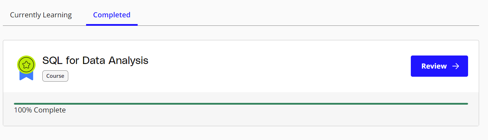

# Udacity Course: SQL for Data Analysis

## Course Description

The Udacity course "[SQL for Data Analysis](https://learn.udacity.com/courses/ud198)" is a comprehensive learning resource designed to equip learners with the fundamental skills required to use SQL (Structured Query Language) for data analysis. The course covers various SQL concepts, techniques, and best practices to effectively query and analyze data from relational databases.

Throughout the course, participants will gain hands-on experience working with real-world datasets and learn how to apply SQL queries to solve practical data analysis problems. The course content is structured in a logical and progressive manner, starting with the basics and gradually advancing to more complex SQL operations and functions. Below you can see the ERD of the database. 

## Course Syllabus

### 1. Introduction to SQL

* Overview of SQL and its importance in data analysis
* Introduction to relational databases and database management systems
* Writing basic SQL queries to retrieve and filter data
* Find content [here](1%20Basic%20SQL/udacity_basic.sql) 

### 2. SQL Joins and Table Relationships

* Understanding table relationships: one-to-one, one-to-many, and many-to-many
* Performing inner joins, left joins, right joins, and full joins
* Using subqueries and derived tables to combine data from multiple tables
* Find content [here](2%20SQL%20joins/udacity_joins.sql) 

### 3. Aggregating Data with SQL

* Grouping data using GROUP BY and HAVING clauses
* Applying aggregate functions like SUM, AVG, COUNT, MIN, and MAX
* Using the ORDER BY clause to sort query results
* Find content [here](3%20SQL%20Aggregation/udacity_aggregation.sql) 

### 4. Advanced SQL Concepts

* Working with complex queries using multiple joins and subqueries
* Utilizing SQL functions for string manipulation, date/time operations, and mathematical calculations
* Understanding window functions for advanced data analysis
* Find content [here](4%20SQL%20Subquery%20and%20Temporary%20Tables/udacity_subquery_temp_table.sql) 

### 5. Data Cleaning and Preparation with SQL

* Handling missing data and NULL values
* Performing data transformations and data cleansing operations
* Applying data validation and integrity checks using constraints
* Find content [here](5%20Data%20Cleaning/udacity_data_cleaning.sql) 

### 6. Window Functions with SQL

* performing calculations across a specific range of rows in the result set.
*  PARTITION BY clause to divide result sets into partitions, allowing for separate calculations within each partition and sort the result sets.
* Amalgamation of Aggregate and Window functions and analytical functions like ROW_NUMBER(), RANK(), and DENSE_RANK()
* Find content [here](6%20Window%20Functions/udacity_window_fun.sql)

### 7. Advance JOINs & Performance Tuning

* Understanding Completeness: Explored FULL OUTER JOIN to retrieve unmatched rows from both tables, ensuring data inclusivity.
* Mastered self join to connect rows within the same table, useful for handling hierarchical data structures.
* Flexible Join Conditions: Explored join operations using comparison operators (e.g., greater than, less than), enhancing data retrieval precision.
* interpreting and optimizing query execution plans, identifying and resolving bottlenecks for improved performance.

## Course Completion

I acquired foundational and advanced SQL skills, mastering Joins, Aggregations, and Window Functions. The course covered data cleaning, preparation, and advanced concepts like FULL OUTER JOIN and self join. I honed precise data retrieval with comparison operators and delved into performance optimization, interpreting query execution plans for improved efficiency. This comprehensive Udacity SQL course empowered me with a robust toolkit for proficient data analysis and database management.

